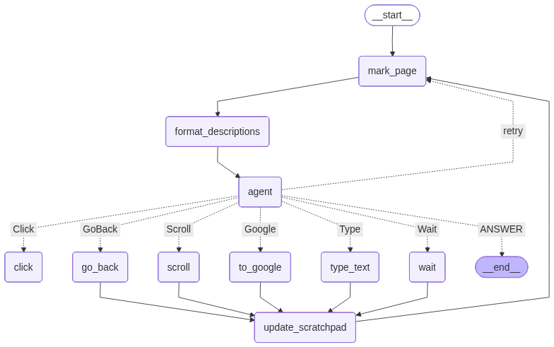

# Web Voyager Agent

LangGraph의 Web Voyager 튜토리얼을 기반으로 구현한 비전 기반 웹 탐색 에이전트입니다. 브라우저 스크린샷을 분석해 UI를 인식하고, 마우스와 키보드 조작으로 웹을 탐색하고 작업을 수행합니다.

## 프로젝트 배경

회사에서 Browser Automation 관련 프로젝트를 진행 중입니다. 관련 분야에서 가장 유명한 논문이자 벤치마킹 대상인 WebVoyager를 참고하기 위해 LangChain의 Web Voyager 튜토리얼을 따라 구현했습니다.

이 프로젝트는 WebVoyager 연구 논문의 아이디어를 학습 목적으로 재현한 구현입니다.

## 데모

[](https://youtu.be/ehJn7OWFFq8)

## Web Voyager란?

WebVoyager(He et al.)는 대규모 멀티모달 모델(LMM)을 활용해 웹 페이지를 시각적으로 이해하고 직접 조작하는 엔드투엔드 웹 자동화 에이전트입니다.

Set-of-Marks 방식으로 UI 요소를 주석 처리하고, LLM이 이를 읽어 ReAct 패턴으로 추론과 행동을 반복 수행하는 구조로 구현했습니다.

## 주요 특징

### 1. 비전 기반 UI 이해

- DOM 파싱 없이 스크린샷 기반 시각적 이해
- 클릭 가능한 요소를 자동 감지 후 번호를 마킹해 LLM이 쉽게 선택 가능

### 2. 실제 브라우저 제어

- Playwright를 통해 실제 사용자처럼 클릭/입력/스크롤 수행

### 3. ReAct(Reason–Action–Observation) 구조

- 현재 화면 → 추론 → 행동 → 관찰 → 반복
- LangGraph의 StateGraph로 상태와 흐름 관리

### 4. 멀티모달 LLM 활용

- Claude 3.7 Sonnet 사용
- 이미지와 텍스트 기반 추론으로 적절한 행동 선택

## 지원 액션

- **Click**: 번호로 지정된 요소 클릭
- **Type**: 텍스트 입력 후 제출
- **Scroll**: 페이지 또는 특정 요소 스크롤
- **Wait**: 로딩 대기
- **GoBack**: 뒤로 가기
- **Google**: Google 홈페이지로 이동
- **ANSWER**: 최종 답변 반환

## 아키텍처 개요



```
START
  ↓
mark_page (스크린샷 + 요소 마킹)
  ↓
format_descriptions (UI 요소 설명 생성)
  ↓
agent (LLM이 다음 액션 결정)
  ↓
도구 실행 (Click / Type / Scroll …)
  ↓
update_scratchpad
  ↓
mark_page (상태 갱신 후 루프)
```

## 설치

### 1. Python 패키지

```bash
pip install -U langgraph langsmith langchain_anthropic langchain-classic python-dotenv
```

### 2. Playwright

```bash
pip install --upgrade playwright
playwright install
```

### 3. 환경 변수

`.env` 파일에 API 키 설정:

```
ANTHROPIC_API_KEY=your_api_key_here
```

### 4. Helper 파일

루트에 `mark_page.js`가 있어야 합니다.

## 실행 방법

### Jupyter Notebook에서 실행

```bash
jupyter notebook web-voyager-agent.ipynb
```

Chrome이 디버깅 모드로 실행 중이어야 합니다:

```bash
chrome --remote-debugging-port=9222 --user-data-dir=/tmp/chrome-debug
```

Notebook에서:

```python
async for event in graph.astream({
    "input": "What is the latest Elon Musk tweet?",
    "page": page,
    "scratchpad": [],
}):
    ...
```

## 기술 스택

- **LangGraph**: 에이전트 실행 그래프
- **LangChain**: LLM 프롬프트 및 모델 관리
- **Claude 3.7 Sonnet**: 멀티모달 모델
- **Playwright**: 실제 브라우저 자동화
- **JavaScript**: UI 마킹 스크립트(mark_page.js)

## 주의사항

- 동적 페이지는 로딩 딜레이가 필요할 수 있습니다
- LLM 호출 비용 발생
- 재시도 로직은 포함되어 있으나 느린 페이지는 추가 Wait 권장

## 참고 자료

- [LangGraph Web Voyager 튜토리얼](https://langchain-ai.github.io/langgraph/tutorials/web-navigation/web_voyager/)
- [Playwright 공식 문서](https://playwright.dev/python/)
- [Claude API 문서](https://docs.anthropic.com/claude/reference/getting-started-with-the-api)